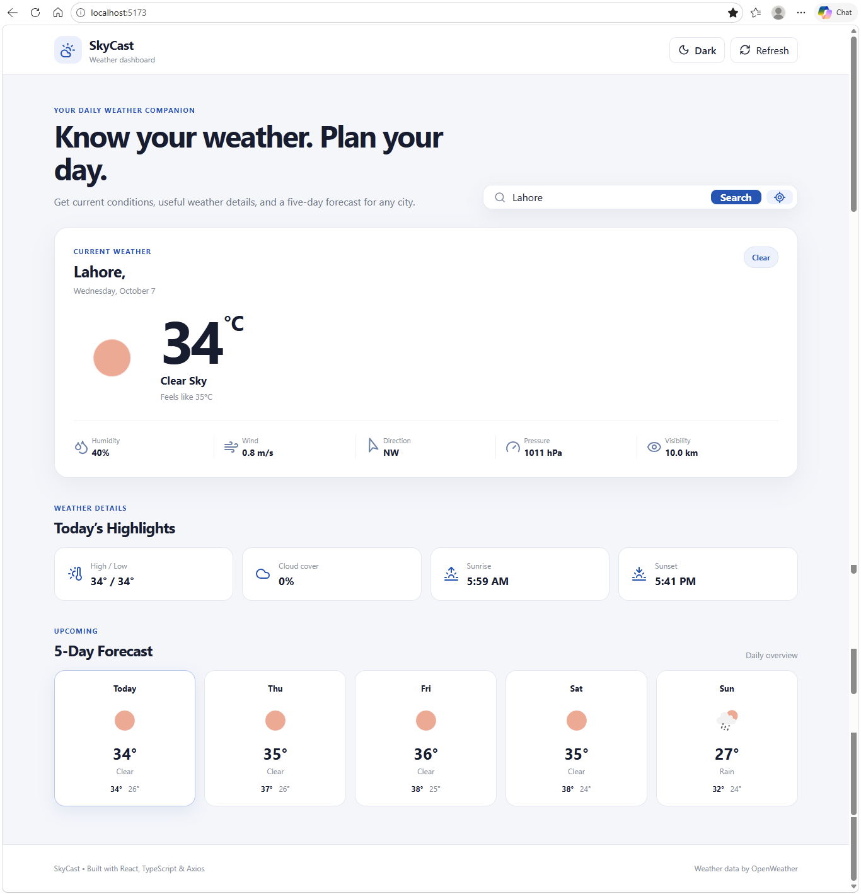
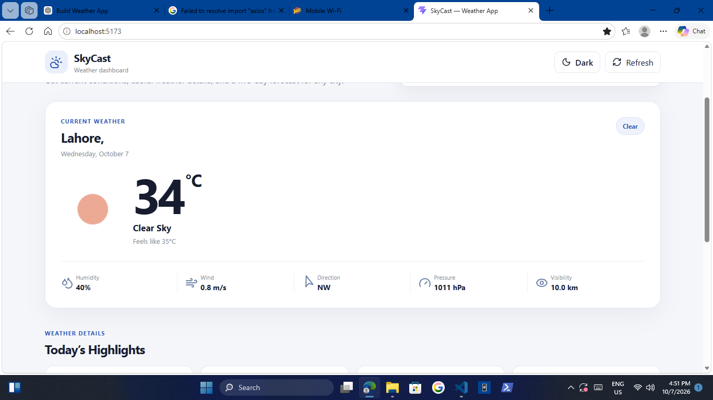
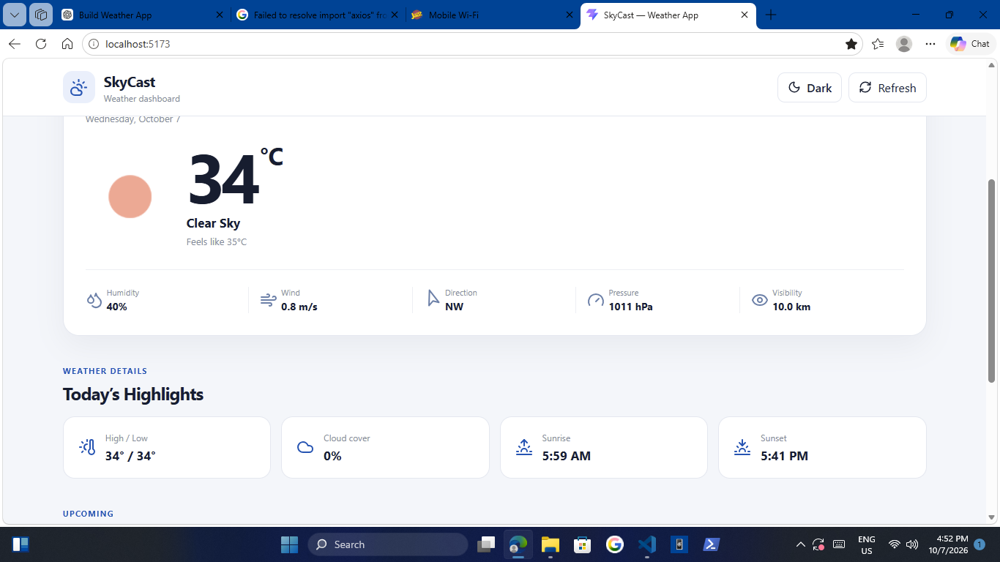
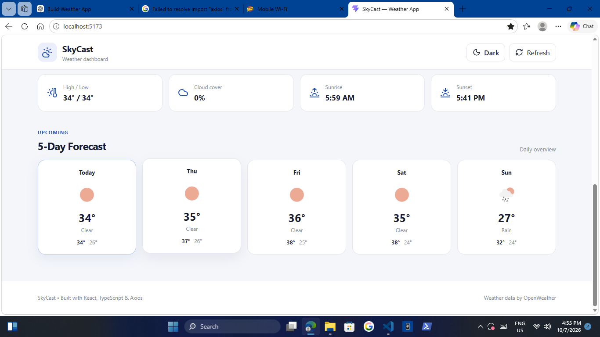
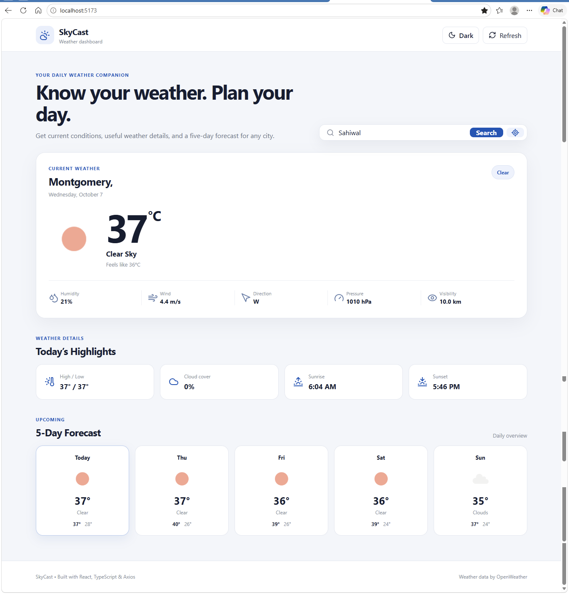
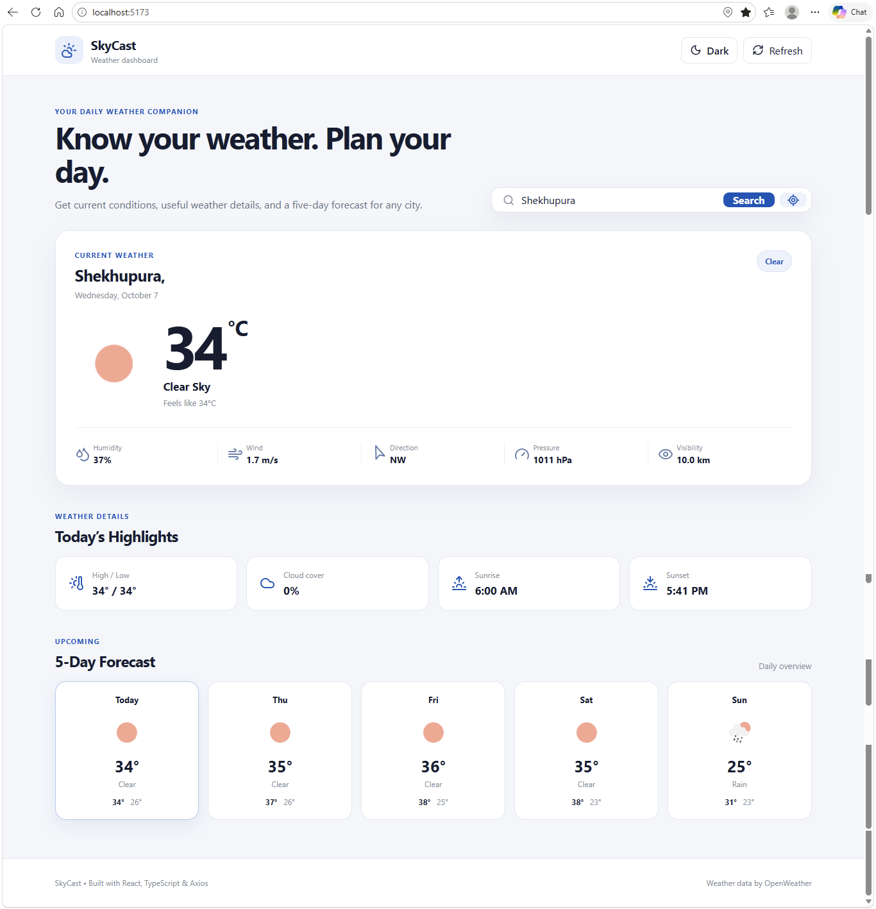
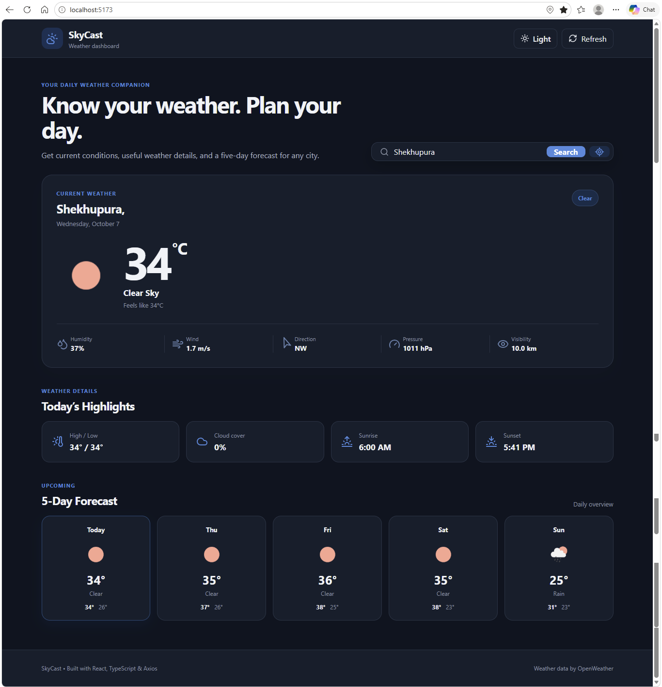

# 🌤️ SkyCast — Weather Forecast Application

A modern and responsive **Weather Forecast Application** built with **React, TypeScript, and Axios**.

This project provides a professional weather dashboard where users can search for cities, view current weather conditions, check detailed weather highlights, view a five-day forecast, use their current location, and switch between light and dark themes.

It was developed as a practical React portfolio project to apply modern frontend development concepts, API integration, responsive design, state management, and reusable component architecture.

---

## 🌦️ Project Preview

### Weather Dashboard

The main dashboard provides a clean overview of the selected city's current weather, including temperature, weather condition, date, and additional weather information.



### Current Weather

Displays detailed information about the current weather conditions of the selected city.



### Weather Highlights

Provides useful weather information such as:

- Humidity
- Wind Speed
- Atmospheric Pressure
- Visibility
- Cloud Coverage



### Five-Day Forecast

Displays a five-day weather forecast with:

- Day
- Weather condition
- Weather icon
- Temperature
- Minimum temperature
- Maximum temperature



### City Search

Users can search for weather information by entering a city name.



### Current Location

Users can use their browser's location service to retrieve weather information for their current location.



### Dark / Light Mode

The application includes a working theme switch that allows users to switch between:

- ☀️ Light Mode
- 🌙 Dark Mode

The theme is implemented using React state and CSS variables.



---

## ✨ Features

### 🌤️ Weather Dashboard

- Displays current weather conditions
- Shows current temperature
- Displays feels-like temperature
- Shows weather description
- Displays weather icon
- Shows selected city
- Displays current date
- Provides a clean professional dashboard layout

### 🔎 City Search

- Search weather by city name
- Search using the OpenWeather API
- Displays weather data for the searched city
- Handles empty search input
- Displays errors when a city cannot be found

### 📍 Current Location

- Uses browser geolocation
- Retrieves the user's current coordinates
- Fetches weather using latitude and longitude
- Handles denied location permissions
- Provides a fallback message when geolocation is unavailable

### 📊 Weather Highlights

Displays additional weather information including:

- Humidity
- Wind speed
- Atmospheric pressure
- Visibility
- Cloud coverage

### 📅 Five-Day Forecast

- Displays a five-day weather forecast
- Shows weather icons
- Displays daily temperatures
- Shows minimum and maximum temperatures
- Displays weather descriptions
- Highlights the current day

### 🔄 Refresh Weather

- Provides a refresh button in the navigation bar
- Reloads weather information for the current city
- Displays a loading animation while refreshing
- Prevents multiple refresh requests while loading

### 🌓 Dark / Light Mode

- Toggle between light and dark themes
- Uses React state for theme management
- Uses CSS variables for theme colors
- Provides different icons for each mode
- Responsive theme button
- Smooth color transitions

### 📱 Responsive Design

The application is designed to work across:

- Desktop
- Laptop
- Tablet
- Mobile devices
- Small mobile screens

The layout automatically adapts according to the screen size.

### ⚠️ Loading & Error Handling

The application handles different API states:

- Loading weather data
- Failed API requests
- Invalid city searches
- Geolocation errors
- Location permission denial

---

## 🛠️ Technologies Used

| Technology              | Purpose                             |
| ----------------------- | ----------------------------------- |
| React                   | Building the user interface         |
| TypeScript              | Static typing and safer development |
| Axios                   | Making API requests                 |
| Vite                    | Development server and build tool   |
| Lucide React            | Icons                               |
| CSS3                    | Styling and responsive design       |
| OpenWeather API         | Weather and forecast data           |
| Browser Geolocation API | Detecting current location          |

---

## ⚛️ React Concepts Used

This project was developed to practice and demonstrate several important React concepts.

### Components

The application is divided into reusable components such as:

- `SearchBar`
- `CurrentWeather`
- `Forecast`
- `Highlights`

This keeps the application organized and easier to maintain.

### State Management

React `useState` is used to manage:

- Selected city
- Current weather
- Forecast data
- Loading state
- Error messages
- Dark / light mode

Example:

```tsx
const [isDarkMode, setIsDarkMode] = useState(false);
```

``

### useEffect

`useEffect` is used to load the default city's weather when the application starts.

```tsx
useEffect(() => {
  loadWeather(DEFAULT_CITY);
}, [loadWeather]);
```

### useCallback

`useCallback` is used for the weather-loading function so that it can safely be used with `useEffect`.

```tsx
const loadWeather = useCallback(async (searchCity: string) => {
  // API request
}, []);
```

### Conditional Rendering

The application conditionally displays:

- Loading state
- Error messages
- Weather information
- Forecast information

For example:

```tsx
{
  loading && !weather ? (
    <div>Loading weather data...</div>
  ) : weather ? (
    <>
      <CurrentWeather weather={weather} />
      <Highlights weather={weather} />
      <Forecast items={forecast} />
    </>
  ) : null;
}
```

### TypeScript Types

Custom TypeScript types are used for weather data and forecast data.

This helps keep API responses structured and reduces common JavaScript errors.

### Conditional Theme Classes

The dark and light themes are controlled through React state.

```tsx
<div className={isDarkMode ? "app-shell dark-mode" : "app-shell"}>
```

---

## 🔗 API Integration

The application uses the **OpenWeather API** to retrieve weather information.

Axios is used to communicate with the API.

### API Flow

```text
User searches for a city
        ↓
SearchBar component
        ↓
Weather API service
        ↓
OpenWeather Geocoding API
        ↓
Latitude & Longitude
        ↓
Current Weather API + Forecast API
        ↓
Weather Data
        ↓
React State
        ↓
Weather Components
        ↓
User Interface
```

### API Services

The API logic is separated from the UI and handled through:

src/services/weatherApi.ts

This keeps API-related code separate from the presentation components.

---

## 📁 Project Structure

weather-app/
│
├── src/
│ │
│ ├── components/
│ │ ├── CurrentWeather.tsx
│ │ ├── Forecast.tsx
│ │ ├── Highlights.tsx
│ │ └── SearchBar.tsx
│ │
│ ├── services/
│ │ └── weatherApi.ts
│ │
│ ├── types/
│ │ └── weather.ts
│ │
│ ├── utils/
│ │ └── weather.ts
│ │
│ ├── App.tsx
│ ├── main.tsx
│ └── styles.css
│
├── public/
│
├── Screenshots
│
├── .env
├── .env.example
├── .gitignore
├── index.html
├── package.json
├── tsconfig.json
├── tsconfig.app.json
├── tsconfig.node.json
├── vite.config.ts
└── README.md

````

---

## 🚀 Getting Started

### 1. Clone the Repository

```bash
git clone YOUR_GITHUB_REPOSITORY_URL
````

### 2. Navigate to the Project

```bash
cd weather-app
```

### 3. Install Dependencies

```bash
npm install
```

### 4. Start the Development Server

```bash
npm run dev
```

The application will run locally using Vite.

### 5. Build for Production

```bash
npm run build

```

---

## 🌐 API Configuration

The application uses the OpenWeather API.

The API key is stored inside an environment variable instead of directly inside the source code.

``.env
VITE_OPENWEATHER_API_KEY=your_api_key_here

This helps keep the API configuration separate from the application code.

> **Note:** Frontend environment variables are not a secure way to hide secrets because they are included in the client-side application during production builds. The API key should therefore use an API provider configuration that allows frontend usage and appropriate restrictions.

---

## 📱 Responsive Design

The application uses responsive CSS media queries to provide a consistent experience across different screen sizes.

### Desktop

- Full navigation layout
- Multi-column weather highlights
- Five-day forecast cards
- Large weather information section

### Tablet

- Responsive hero section
- Adapted weather detail layout
- Responsive highlights grid
- Horizontal forecast scrolling when required

### Mobile

- Compact navigation
- Icon-based theme and refresh buttons
- Responsive weather information
- Two-column weather details
- Single-column highlights on small screens
- Mobile-friendly search bar
- Horizontal forecast layout

---

## 🎯 Project Objectives

The main objectives of this project were:

1. Practice React component-based development.
2. Practice TypeScript with React.
3. Learn how to consume external APIs.
4. Use Axios for HTTP requests.
5. Practice asynchronous JavaScript.
6. Implement loading and error states.
7. Practice React state management.
8. Create reusable React components.
9. Build a responsive professional interface.
10. Implement browser geolocation.
11. Implement a dark and light theme.
12. Practice organizing a React project into services, components, types, and utilities.

---

## 🔮 Future Improvements

The following improvements can be added in future versions:

- Hourly weather forecast
- Weather forecast charts
- Multiple saved cities
- Favorite cities
- Automatic weather updates
- Weather alerts
- More detailed weather statistics
- Improved accessibility
- Unit switching between Celsius and Fahrenheit
- Weather history
- More advanced animations
- PWA support
- Backend integration for user accounts and saved preferences

---

## 🧭 Development Stages

The project was developed gradually through the following stages:

### Stage 1 — Project Setup

- React + TypeScript setup
- Vite configuration
- Project structure
- Basic application layout

### Stage 2 — UI Development

- Navigation bar
- Weather dashboard
- Search interface
- Weather cards
- Forecast section
- Responsive layout

### Stage 3 — API Integration

- OpenWeather API integration
- Axios configuration
- City geocoding
- Current weather API
- Forecast API

### Stage 4 — State Management

- Weather state
- Forecast state
- Loading state
- Error state
- Search state

### Stage 5 — Location Feature

- Browser geolocation
- Current location weather
- Location permission handling

### Stage 6 — Theme System

- Light mode
- Dark mode
- React theme state
- CSS variables
- Responsive theme button

### Stage 7 — Responsive Design

- Desktop layout
- Tablet layout
- Mobile layout
- Small-screen optimizations

---

## 💡 Why This Project?

This project was created as part of my **React frontend portfolio journey**.

The main purpose was to build a practical application that demonstrates the ability to:

- Build a complete React application
- Work with TypeScript
- Consume third-party APIs
- Handle asynchronous requests
- Create reusable components
- Manage application state
- Handle loading and error states
- Build responsive interfaces
- Work with browser APIs
- Implement a professional theme system

Rather than creating only a static weather UI, this project focuses on making the application functional through real API data.

---

## 📚 Learning Purpose

This project helped strengthen practical knowledge of:

- React
- TypeScript
- Axios
- REST APIs
- API response handling
- React Hooks
- Component architecture
- Conditional rendering
- State management
- CSS variables
- Responsive CSS
- Browser Geolocation API
- Error handling
- Environment variables

---

## 📱 Responsive Design

The application was designed with a mobile-first responsive mindset.

The interface adapts to different screen sizes while maintaining:

- Readable typography
- Accessible controls
- Responsive weather cards
- Flexible layouts
- Mobile-friendly navigation
- Usable search functionality
- Responsive forecast cards
- Compact theme controls

---

## Live link & GitHub Repository


## 👨‍💻 Author

**Abdullah Saeed**

Frontend Developer | React Developer

This project is part of my frontend development portfolio and learning journey.

---

## 📄 License

This project was created for educational and portfolio purposes.

You are free to use the project as a reference for learning and development.

```

```
